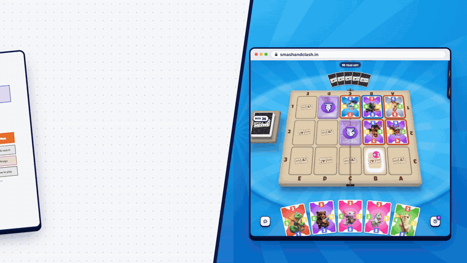
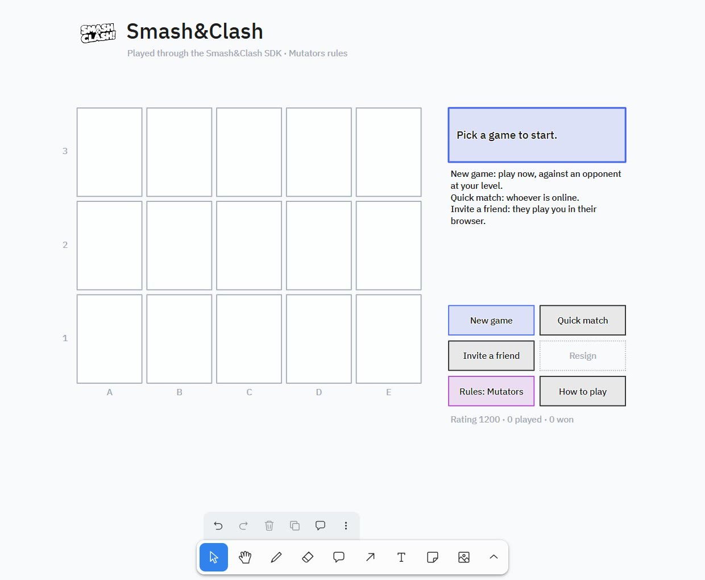
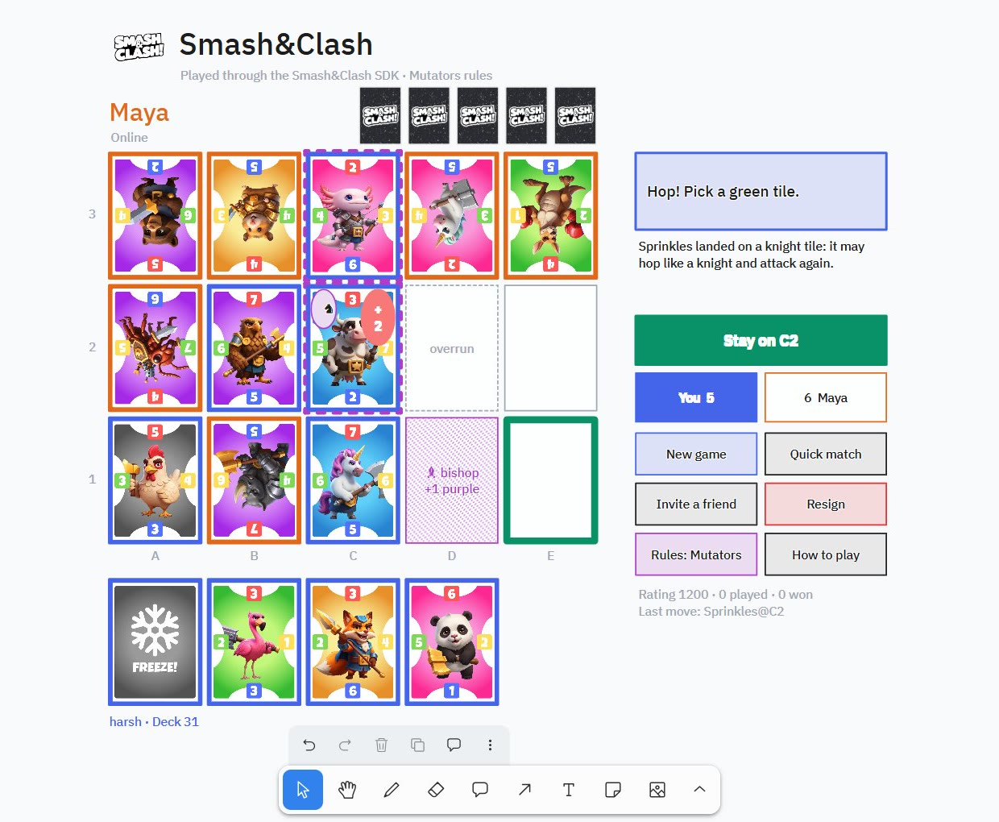
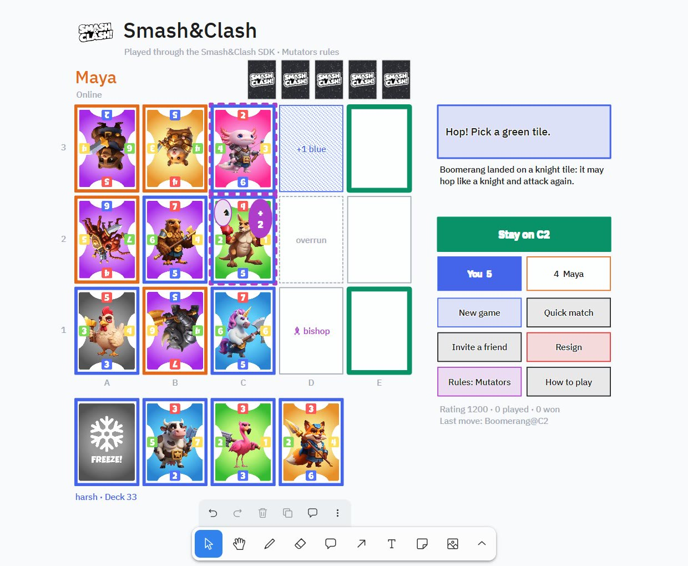
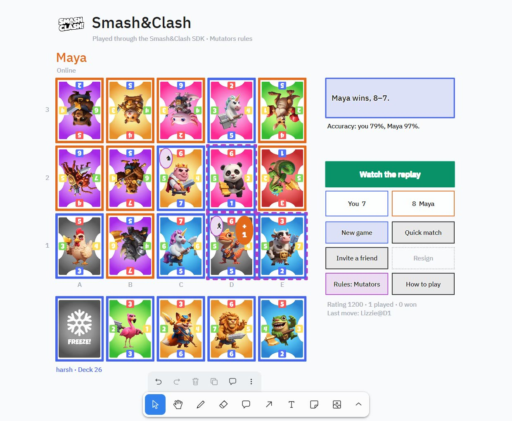
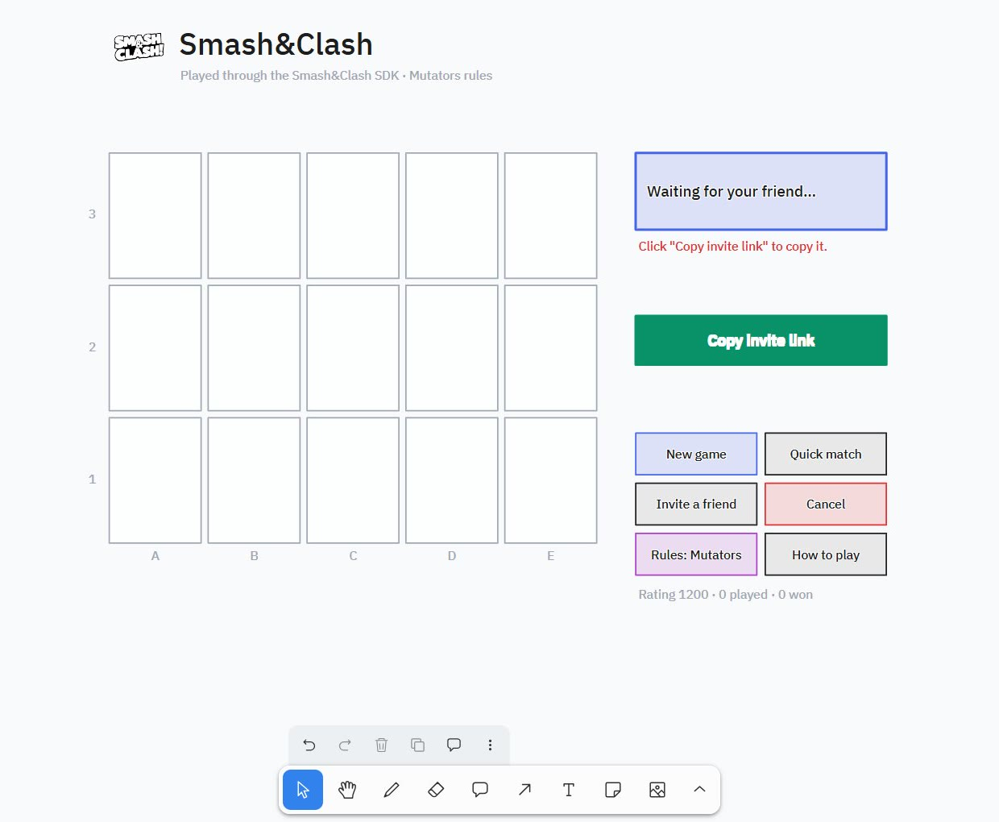
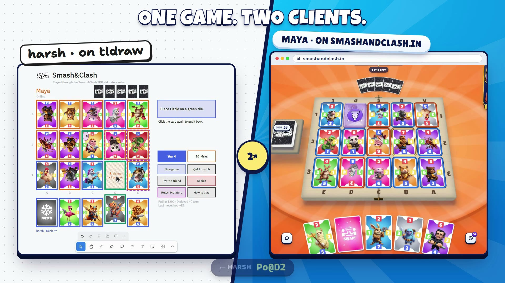
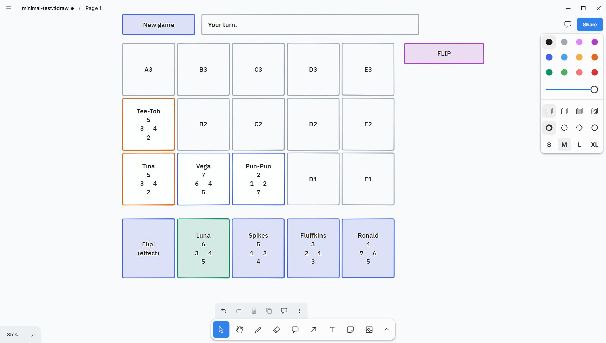

<div align="center">

# Smash&Clash on tldraw

**A complete Smash&Clash client that runs on a tldraw board, built with the official [Smash&Clash SDK](https://docs.smashandclash.in).**

One real game, two very different clients: in the film below, the tldraw board in this repo plays a friend who is playing normally on [smashandclash.in](https://www.smashandclash.in). Same game, same moves, both screens.

[](https://github.com/smashandclash/tldraw/releases/download/v1.0.0/smashandclash-sdk-tldraw.mp4)

**[▶ Watch the 36-second film (1080p MP4)](https://github.com/smashandclash/tldraw/releases/download/v1.0.0/smashandclash-sdk-tldraw.mp4)** · [Portrait cut (9:16)](https://github.com/smashandclash/tldraw/releases/download/v1.0.0/smashandclash-sdk-tldraw-portrait.mp4) · [media/smashandclash-sdk-tldraw.mp4](media/smashandclash-sdk-tldraw.mp4)

**Build your own client today: [docs.smashandclash.in](https://docs.smashandclash.in)**

</div>

---

The Smash&Clash SDK lets you build your own Smash&Clash client, as weird as you like. This repo is the proof: a whiteboard that plays the real game against real people, plus everything you need to build one of your own.

## Contents

- [What's in here](#whats-in-here)
- [Play it in a minute](#play-it-in-a-minute)
- [Screenshots](#screenshots)
- [How to play](#how-to-play)
- [Put it on any board](#put-it-on-any-board)
- [How it works](#how-it-works)
- [The SDK, call by call](#the-sdk-call-by-call)
- [Start smaller: the minimal board](#start-smaller-the-minimal-board)
- [Node examples](#node-examples)
- [Build your own client](#build-your-own-client)
- [How the film was made](#how-the-film-was-made)
- [Troubleshooting](#troubleshooting)
- [Links](#links)

## What's in here

| Path | What it is |
| --- | --- |
| [`board/smashandclash.tldraw`](board/smashandclash.tldraw) | **The board from the film.** Open it in tldraw Desktop and play. The script travels inside the file. |
| [`board/script/main.js`](board/script/main.js) | The full client (~780 lines, commented): New game, Quick match, Invite a friend, resign, Mutators/Classic, How to play, Game Review, resume on reopen. |
| [`board/script/smashandclash-sdk.js`](board/script/smashandclash-sdk.js) | `@smashandclash/sdk` 0.5.0, the published npm build, vendored so a board can import it. |
| [`examples/minimal-board/`](examples/minimal-board) | The same idea in ~140 lines with plain shapes. Read this first. |
| [`examples/node/`](examples/node) | Five small Node scripts: play the house, invite a person, draw your own board, watch live, review a game. |
| [`scripts/vendor-sdk.mjs`](scripts/vendor-sdk.mjs) | Refreshes the vendored SDK in both board scripts from npm. |
| [`docs/how-it-works.md`](docs/how-it-works.md) | The board client's architecture, part by part. |
| [`docs/build-your-own-client.md`](docs/build-your-own-client.md) | A checklist for building any Smash&Clash client on the SDK. |
| [`media/`](media) | The film, its preview, and the screenshots below. |

## Play it in a minute

You need **tldraw Desktop** (the offline app with board scripts) and an internet connection. The game runs on smashandclash.in's servers; the board is the client.

1. Download [`board/smashandclash.tldraw`](board/smashandclash.tldraw) (or clone this repo).
2. Open it in tldraw Desktop. tldraw says **"This file contains a script"**: choose **Run Script**. It only asks the first time.
3. Click **New game** in the panel on the right, and play.

To play a person instead, click **Invite a friend**: the board copies an invite link. Your friend opens it in their browser (or in a terminal with `npx smashandclash play <link>`) and you play each other, board vs browser, exactly like the film. **Quick match** pairs you with whoever is online.

## Screenshots

| | |
| :---: | :---: |
|  |  |
| **The lobby.** New game, Quick match, Invite a friend, rules and the how-to-play panel. | **A game in progress.** Your hand is at the bottom; the opponent's cards are turned to their side, the way the game draws them. |
|  |  |
| **A hop.** A card on a chess tile may hop like that piece and attack again: the board lights the tiles it can reach. | **Game over.** The result, both players' Game Review accuracy and a replay link. |
|  |  |
| **Invite a friend.** The link is copied for you; the game starts when they open it. | **One game, two clients.** tldraw on the left, smashandclash.in on the right, the same move on both. |

## How to play

Smash&Clash is a two-player game on a 3×5 board. Each player holds 5 cards and plays one per turn.

- **Characters** have four side values (1–7). Place one on an empty tile and it attacks each neighbour that faces the other player: if your touching side is at least theirs, that card turns to you. The board is the score; when all 15 tiles are full, whoever has more cards facing them wins.
- **Effects** (Boulder!, Flip!, Freeze!, Recruit!, Swap!) play when they can do something.
- **Mutators** (the default rules) add chess tiles (hop like a knight, bishop, rook or queen), power tiles (+1/+2 for a colour) and overrun zones.

**Play anyone, on any client.** The board is one client of the Smash&Clash game network, like smashandclash.in, the terminal or Telegram ([one game, every client](https://docs.smashandclash.in/clients)):

- **Quick match** waits in the queue every client shares, so you can be paired with someone on the website.
- **Room code** makes a room and copies its link. Your friend joins with the code on smashandclash.in (**Play a friend → Join**), in a terminal (`npx smashandclash open CODE`) or in any app.
- **Join a game** joins a friend's room from any client: type their code or link into the green note beside the panel (or just copy it), then click the button. A room that's already full opens to watch.

On the board: **click a card, then a green tile.** An effect that needs a target lights its tiles the same way (Recruit! takes two tile clicks: the card to take, then where it goes); an effect with no target (Flip!, Swap!) plays when you click it a second time or press its green button. During a hop, click a green tile or **Stay**. You are always blue and the other side orange, whichever seat you hold. The full rules live at [docs.smashandclash.in](https://docs.smashandclash.in).

## Put it on any board

The client is a **board script**: a folder of JavaScript that tldraw Desktop embeds in the `.tldraw` file and runs when the board opens.

1. Open (or create) a board in tldraw Desktop.
2. **Develop → Reveal Script…** opens that board's `script/` folder.
3. Copy [`board/script/main.js`](board/script/main.js) and [`board/script/smashandclash-sdk.js`](board/script/smashandclash-sdk.js) into it. tldraw notices the change and runs the script straight away (**Develop → Reload Script** runs it again).
4. Save the board. The script is now inside the file, wherever it goes.

Everything the game draws is **ephemeral**: it renders on your screen but never lands in the document, so a saved board stays clean and redraws itself on open. The only thing the document keeps is the game's record (your rating, your rules and the game in progress) in its metadata, which is how reopening the board picks a game up where you left it. The game's shapes are locked so a click plays instead of selecting; **Edit → Unlock All** frees them.

## How it works

The board script is an ordinary ES module. tldraw calls its default export with the live `editor`, a few `helpers`, and an abort `signal`:

```js
import { AssetRecordType, createShapeId, toRichText } from 'tldraw'
import { SmashAndClash } from './smashandclash-sdk.js'

export default function ({ editor, helpers, signal, app }) {
  const sc = new SmashAndClash({ client: 'tldraw' })   // games show the other side where you play from
  // state -> scene() -> renderEphemeral(diff) ; clicks -> SDK call -> state
}
```

It has one loop: **SDK state → draw → click → SDK call → new state.**

1. **State** comes from the SDK's `Game` (`game.view`: your hand, the board with each card's board-frame sides, special tiles, `legalMoves` on your turn), plus a little UI state (the selected card, the tiles picked so far, notices).
2. **`scene()`** turns that state into a list of tldraw shapes: geo tiles, image shapes for the real card art (served from smashandclash.in), text, buttons.
3. **`render()`** diffs that list against what is on the canvas and creates, updates or deletes shapes inside `helpers.renderEphemeral(...)`, so nothing touches the saved document or the undo stack.
4. **Clicks** come from `editor.on('event')`. A hit test against the clickable shapes calls an action, and every action goes through the SDK (`game.play('Pengu@C2')`, `sc.games.createDuel(...)`, `game.resign()`).
5. **Waiting** is a long-poll pump (`game.waitForTurn()`, up to 20 s per call) that redraws whenever the other side moves.

Moves are strings, named the way the SDK names them: `Pengu@C2` places, `Teddy!C2` overruns, `hop→E3` / `hop: stay` resolve a hop, and `BOULDER(D2)`, `FREEZE(C1)`, `RECRUIT(D3→B1)`, `FLIP`, `SWAP` play effects. The board turns your clicks into one of those names, and only ever offers names from `legalMoves`.

The details (orientation for either seat, the effect click paths, personas, shared boards, and the gotchas) are in **[docs/how-it-works.md](docs/how-it-works.md)**.

## The SDK, call by call

Every feature on the board is one or two SDK calls:

| On the board | SDK |
| --- | --- |
| **New game** (an opponent at your level) | `sc.games.startHouse({ name, as: 'person', ruleset, strength })`, where `strength` is the opponent's rating (800–1600) |
| **Quick match** | `sc.games.quickMatch({ name, as: 'person', opponent: 'any' })`, then `game.waitForOpponent()` |
| **Invite a friend** | `sc.games.createDuel({ name, as: 'person', opponent: 'person' })` gives `game.inviteUrl` |
| **Room code** | `sc.games.createDuel({ name, as: 'person', rating })` gives `game.code` and `game.joinLink`, joined from any client |
| **Join a game** | `sc.games.open(codeOrLink, { name, as: 'person', rating })`: a seat, or a full room to watch |
| Play a card | `game.play('Pengu@C2')` (against the house it resolves after the reply) |
| Wait for the other side | `game.waitForTurn(20)`, a long poll |
| **Resign / Cancel** | `game.resign()`; a game nobody joined is left with `game.leave()`, which never resigns one that started a moment before |
| Card art and names | `sc.cards()`, the 51-card deck with image URLs |
| **How to play** | `sc.rules()` |
| Game over: accuracy and replay | `game.review()` and `game.replayUrl` |
| Reopen the board mid-game | `sc.games.resume(id, playerToken)` |

```js
const sc = new SmashAndClash()
const game = await sc.games.startHouse({ name: 'tldraw player', as: 'person' })

while (!game.over) {
  if (!game.yourTurn) { await game.waitForTurn(); continue }
  await game.play(game.legalMoves[0])        // your UI picks this one
}
console.log(game.winner, game.replayUrl)
const review = await game.review()          // accuracy per player, turning point, biggest blunder
```

The full API, including hosting matches between two people, spectating, replays and Hosted Agent Challenges, is at **[docs.smashandclash.in](https://docs.smashandclash.in)**.

> **The SDK in a browser.** A board script simply calls `new SmashAndClash({ client: 'tldraw' })` (SDK 0.2.1 and newer; 0.5.0 is vendored here). The `client` name travels with every request, so games show the other side that you play from tldraw. The film's board file carries SDK 0.2.0, which needed a plain-function `fetch` that dropped its `x-sdk` header.

## Start smaller: the minimal board

[`examples/minimal-board/script/main.js`](examples/minimal-board/script/main.js) is the whole idea in about 140 lines: plain geo shapes, no card art, the house opponent only. Effects and hops appear as buttons named by their move (`FLIP`, `hop→E3`), so every legal move is one click away. Install it the same way (**Develop → Reveal Script…**, copy both files).



## Node examples

The same SDK runs in Node 18+, Deno, Bun and browsers. These scripts are small and commented:

```bash
npm install
npm run play-house                  # play one game against the house with a simple strategy
npm run invite                      # print an invite link, wait for a person, play them
npm run draw-board                  # draw the table yourself from game.sync() (the "draw your own board" pattern)
npm run watch                       # follow a public game live, as a spectator
npm run review -- <gameId | link>   # a finished game's replay and Game Review
```

| Script | Shows |
| --- | --- |
| [`play-house.mjs`](examples/node/play-house.mjs) | `startHouse`, `legalMoves`, `play`, `greedyMove`, `replayUrl` |
| [`invite-a-person.mjs`](examples/node/invite-a-person.mjs) | `createDuel({ opponent: 'person' })`, `inviteUrl`, `waitForOpponent`, `playOut` |
| [`draw-your-own-board.mjs`](examples/node/draw-your-own-board.mjs) | `sync()`: your seat's state by card id and every move's public events |
| [`watch-live.mjs`](examples/node/watch-live.mjs) | `live()`, `spectate()` |
| [`review-a-game.mjs`](examples/node/review-a-game.mjs) | `replay()`, `review()`, `replays.read()` for shared links |

After an SDK upgrade, `npm run vendor-sdk` copies the new browser build into both board scripts.

## Build your own client

A tldraw board is one surface. The same few calls work for a Discord bot, a terminal UI, a game engine, a physical board with a camera, or something nobody has thought of yet. **[docs/build-your-own-client.md](docs/build-your-own-client.md)** is the checklist: the state you get, move names, drawing the board from either seat (and why a captured card turns round), effects, hops and overruns, waiting, errors and rate limits, and fair play.

## How the film was made

[](https://github.com/smashandclash/tldraw/releases/download/v1.0.0/smashandclash-sdk-tldraw.mp4)

Nothing in the film is staged. One live game was recorded on two screens on a single clock. The tldraw side was captured through tldraw Desktop's local agent API (window screenshots about every 66 ms, with moves made by real canvas pointer events on the board's own controls). The browser side was a headless Chrome screencast of smashandclash.in, which opened the board's invite link and played its seat through the site's own move tool. Both recordings were rebuilt on one timeline, so every move in the montage lands on both screens exactly when it did live. The motion design was built in [HyperFrames](https://hyperframes.heygen.com).

## Troubleshooting

- **Nothing appears on the board.** Check **Develop → Enable Script** is on, then **Develop → Reload Script**. If you opened the file with "Open Without Script", reopen it and choose **Run Script**.
- **"Could not reach smashandclash.in"**: the client needs the internet; the game itself runs on the server.
- **A click selects instead of playing.** Use the select tool (V). The board ignores clicks while another tool is active.
- **I want to move or restyle the board.** The game's shapes are locked and redrawn by the script. **Edit → Unlock All** frees them, but the script owns their look; change it in `scene()`.
- **Two people on a shared board.** Every participant runs the script and plays their own game (it is all ephemeral); only the host writes the record into the file.

## Links

- **Docs and API: [docs.smashandclash.in](https://docs.smashandclash.in)**
- Play: [smashandclash.in](https://www.smashandclash.in)
- SDK on npm: [`@smashandclash/sdk`](https://www.npmjs.com/package/@smashandclash/sdk)
- OpenAPI 3.1: [smashandclash.in/openapi.json](https://www.smashandclash.in/openapi.json)
- MCP server for agents: `https://www.smashandclash.in/api/mcp`
- The terminal client: `npx smashandclash`
- Agent plugin: [smashandclash/plugin](https://github.com/smashandclash/plugin)

## License

The code in this repo (the board scripts, examples and tools) is MIT licensed; see [LICENSE](LICENSE). That includes the vendored SDK build, which is MIT too. The Smash&Clash game, its rules, characters, artwork, audio and other assets are proprietary and are not licensed here. The board loads card art from smashandclash.in at runtime, and the film is © Smash&Clash.
